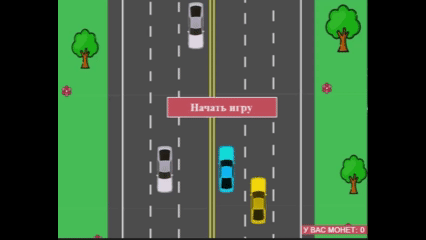

# Привет! 👋 Я Элина

💻 Студентка 4 курса, направление **Математическое обеспечение и администрирование информационных систем**  
🏫 Уфимский университет науки и технологий  
👩‍🎓 Студентка **Школы 21**  
🌍 Город: Уфа  

## 🔹 Навыки
- Языки программирования: Python, C#, C++, C, SQL  
- Разработка: API, игры, графические приложения  
- Алгоритмы и структуры данных

## 📫 Контакты
- 📧 Email: khamatvalievawork@mail.ru  
- 📱 Telegram: @Khelyus

## 🚀 Pet-проекты

> Мини-игра с управлением машинкой (C#, командная работа)

<!--
**Khelyus/Khelyus** is a ✨ _special_ ✨ repository because its `README.md` (this file) appears on your GitHub profile.

Here are some ideas to get you started:

- 🔭 I’m currently working on ...
- 🌱 I’m currently learning ...
- 👯 I’m looking to collaborate on ...
- 🤔 I’m looking for help with ...
- 💬 Ask me about ...
- 📫 How to reach me: ...
- 😄 Pronouns: ...
- ⚡ Fun fact: ...
-->
